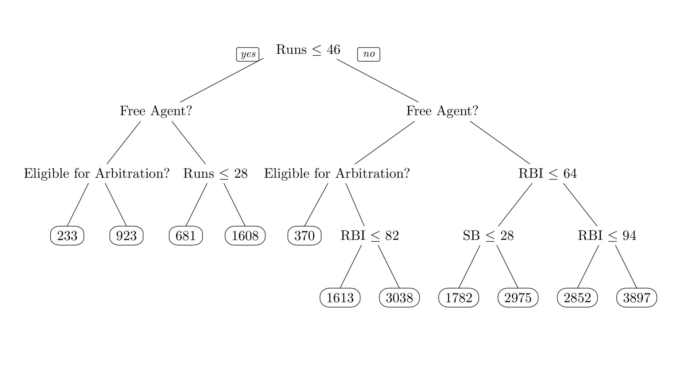
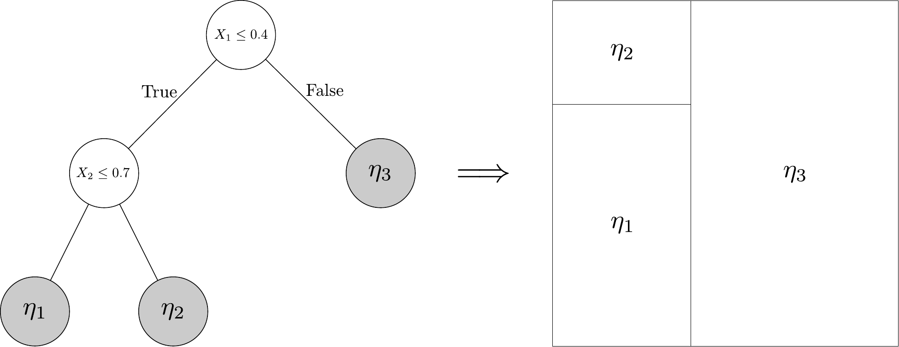

# Nonparametric Methods

## Overview

In this set of notes, we will shift attention to various models that are referred to (broadly) as _nonparametric_. Roughly, a model $\mathcal F = \{f_\theta : \theta \in \Theta\}$ is "nonparametric" if an $f \in \mathcal F$ "could be anything." Of course, this is a vague statement, and in reality the meaning of what a "nonparametric method" or a "nonparametric model" is varies according to context and the whims of whoever is writing about the topic. A couple of examples include:

1. Suppose $Z_1, \ldots, Z_n \iid F_0$ where $F_0 \in \mathcal F$ and $\mathcal F$ is the set of all possible distributions on $\mathbb R$, and we want to estimate the distribution of $Z_i$. This is the problem of _nonparametric distribution estimation_.

1. Ditto the above problem, except now we want to estimate the density $f_0$ of $F_0$. This is a problem of _nonparametric density estimation_, with the class $\mathcal F$ consisting of all distributions on $\mathbb R$ that have a density.

1. Suppose we have
$$
  Y_i = \mu(X_i) + \epsilon_i
$$
where $\epsilon_i \iid \Normal(0, \sigma^2)$. We assume $\mu(x)$ is an arbitrary function. While this is probably more accurately referred to as _Gaussian semiparametric regression_, some folks still regard this as a nonparametric problem.

Nonparametric models can be contrasted with _parametric_ models and _semiparametric_ models. Semiparametric models are halfway between parametric and nonparametric models: they have a _parametric component_ indexed by a finite-dimensional parameter $\theta$, and a _nonparametric component_ indexed by an infinite-dimensional parameter $\eta$, which is often viewed as a nuisance parameter. In the case of the semiparametric Gaussian regression model, this term would apply with $\theta = \sigma^2$ (the error variance is finite dimensional) and $\eta = \mu$ (the regression function is not).

## Linear Smoothing and Basis Function Expansions

Much of the material in this section is borrowed from the notes of James Scott (with some minor changes on my part); the original is available [at this repository](https://github.com/jgscott/SDS383D/blob/master/exercises/exercises06-SDS383D.pdf). All errors and typos past this point are, of course, my own `r emo::ji("smile")`.

### The Bias-Variance Tradeoff

Let $\widehat \mu(x)$ be a noisy estimate of some function $\mu(x)$ at some point $x$ and define the _mean-squared error_ of the estimate as
$$
  \MSE(\widehat\mu, \mu)
  =
  \E_\theta\left[ \{\widehat\mu(x) - \mu(x)\}^2 \right].
$$

:::{.exercise}

Show that $\MSE(\widehat\mu, \mu)$ decomposes into a _bias_ term and a _variance_ term $\MSE = B^2 + V$:
$$
  B = \E_\theta\{\widehat\mu(x)\} - \mu(x)
  \qquad \text{and} \qquad
  V = \Var\{\widehat\mu(x)\}.
$$

:::

This decomposition is referred to as the _bias-variance decomposition_. Nonparametric function estimation involves balancing these quantities: how small can we make the bias while keeping the variance manageable?

:::{.exercise name="Density Estimation With Histograms"}

Some people refer to the decomposition above as the _bias-variance tradeoff_. Why is this a tradeoff? Here's a simple example to convey the intuition.

Suppose we observe $Z_1, \ldots, Z_N$ from some distribution $F$ and want to estimate $f(0)$, the value of the probability density at $0$. Let $h$ be a small positive number, called the _bandwidth_, and define the quantity
$$
  \pi_h 
  = \Pr\left( -\frac{h}{2} < Z < \frac{h}{2}\right)
  = \int_{-\frac{h}{2}}^{\frac{h}{2}} f(z) \ dz.
$$
For small $h$ we have $\pi_h \approx h \, f(0)$ provided that $f(x)$ is continuous at $0$.

a. Let $M$ be the number of observations in a sample of size $N$ that fall within the interval $(-h/2, h/2)$. What is the distribution of $M$. What are its mean and variance in terms of $N$ and $\pi_h$? Propose a simple estimator $\widehat f(0)$ of $f(0)$ based on $M$.

b. Suppose we expand $f(z)$ in a second-order Taylor series about $0$:
$$
  f(z) \approx f(0) + f'(0) \, z + \frac{1}{2} f''(0) \, z^2.
$$
Use this, together with the bias-variance decomposition, to show that
$$
  \MSE\{\widehat f(0), f(0)\}
  \approx
  A h^4 + \frac{B}{Nh}
$$
for constants $A$ and $B$ that you should (approximately) specify. What happens to the bias and variance when you make $h$ small? When you make $h$ big?

c. Use this result to derive an expression for the bandwidth that minimizes the mean-squared error as a function of $N$. You can approximate any constants that appear, but make sure you get the right functional dependence on the sample size.

:::

### Curve Fitting by Linear Smoothing

:::{.exercise}

Consider a nonlinear regression problem with one predictor and one response: $Y_i = \mu(X_i) + \epsilon_i$ where the $\epsilon_i$'s are mean-zero random variables.

a. Suppose you want to estimate the value of the regression function $\mu(x^\star)$ at some new point $x^\star$. Assume for the moment that $\mu(x)$ is linear and that both $Y_i$ and $X_i$ are mean $0$, in which case $Y_i = \beta \, X_i + \epsilon_i$.

    Recall the least-squares estimator for multiple regression. Show that for the one-predictor case, your prediction $\mu(x^\star) = \widehat \beta \, x^\star$ can be expressed as a _linear smoother_ of the form
$$
  \widehat \mu(x^\star)
  =
  \sum_{i=1}^N w(X_i, x^\star) \, Y_i
$$
    for any $x^\star$. Inspect the weighting function you derived. Briefly describe your understanding of how the resulting smoother behaves, compared with the smoother that arises from an alternate form of the weight function $w(X_i, x^\star)$:
$$
  w_K(X_i, x^\star) = 
  \begin{cases}
    1 / K \qquad & 
      \text{if $X_i$ is one of the $K$ closest sample points to $x^\star$},  \\
    0 \qquad & \text{otherwise}.
  \end{cases}
$$
    This is referred to as the _K-nearest neighbor_ smoother.

b. A _kernel function_ $K(x)$ is a smooth function satisfying
$$
  \int_{-\infty}^\infty K(x) \ dx = 1, 
  \qquad
  \int_{-\infty}^\infty x \, K(x) \ dx = 0.
  \qquad
  \int_{-\infty}^\infty x^2 \, K(x) \ dx < \infty.
$$
    A very simple example is the uniform kernel,
$$
  K(x) = \frac{1}{2} \, I(x) \qquad \text{where} \qquad
  I(x) = \begin{cases}
    1 \qquad & \text{if $|x| \leq 1$}, \\
    0 \qquad & \text{otherwise}.
  \end{cases}
$$
    Another common choice is the _Gaussian kernel_,
$$
  K(x) = \frac{1}{\sqrt{2 \pi}} \, \exp\left(-\frac{x^2}{2}\right).
$$
    Kernels are used as weighting functions for taking local averages; specifically, define the weighting function
$$
  w(X_i, x^\star) = \frac{1}{h}K\left(\frac{X_i - x^\star}{h}\right),
$$
    where $h$ is the bandwidth. Using this weighting function in a linear smoother is called _kernel regression_. (The weighting function gives unnormalized weights; you should also normalize the weights so that they sum to $1$.)

    __Write your own `R` function that will fit a kernel smoother for an arbitrary set of $(X_i, Y_i)$ pairs and arbitrary choice of (positive real) bandwidth $h$, and test it on a nonlinear function of your choice.__ You may choose your own kernel. Set up an `R` script that will simulate noisy data from some nonlinear function $Y_i = \mu(X_i) + \epsilon_i$; subtract the sample means from the simulated data; and use your function to fit the kernel smoother for some choice of $h$. Plot the estimated functions for a range of bandwidths wide enough to yield noticable differences in the qualitative behavior of the prediction functions.

:::

### Cross Validation

:::{.exercise}

Left unanswered so far in our previous study of kernel regression is the question: how does one choose the bandwidth $h$ used for the kernel?  Assume for now that the goal is to predict well, not necessarily to recover the truth.  (These are related but distinct goals.)  

a. Presumably a good choice of $h$ would be one that led to smaller predictive errors on fresh data.  Write a function or script that will: (1) accept an old ("training") data set and a new ("testing") data set as inputs; (2) fit the kernel-regression estimator to the training data for specified choices of $h$; and (3) return the estimated functions and the realized prediction error on the testing data for each value of $h$.  This should involve a fairly straightforward "wrapper" of the function you've already written.

b. Imagine a conceptual two-by-two table for the unknown, true state of affairs.  The rows of the table are "wiggly function" and "smooth function," and the columns are "highly noisy observations" and "not so noisy observations."  Simulate one data set (say, 500 points) for each of the four cells of this table, where the $X_i$'s take values in the unit interval.  Then split each data set into training and testing subsets.  You choose the functions.^[Trigonometric functions, for example, can be pretty wiggly if you make the period small.] Apply your method to each case, using the testing data to select a bandwidth parameter.  Choose the estimate that minimizes the average squared error in prediction, which estimates the mean-squared error:
$$
L_N(\widehat{\mu}) = \frac{1}{N^\star}\sum_{i=1}^{N^{\star}} (Y^{\star}_i - \widehat{Y}_i^{\star} )^2 \, ,
$$
where $(Y_i^{\star}, X_i^{\star})$ are the points in the test set, and $\widehat{Y}_i^{\star}$ is your predicted value arising from the model you fit using only the training data.  Does your out-of-sample predictive validation method lead to reasonable choices of $h$ for each case?

c. __Optional: ("leave-one-out lemma)"__ Splitting a data set into two chunks to choose $h$ by out-of-sample validation has some drawbacks.  (See if you can think of two; one is obvious, one is more subtle.)  Then consider an alternative: leave-one-out cross validation.  Define
$$
\mbox{LOOCV} = \sum_{i=1}^N \left( Y_i - \widehat{Y}_{i}^{(-i)} \right)^2 \, ,
$$
where $\widehat{Y}_{i}^{(-i)}$ is the predicted value of $Y_i$ obtained by omitting the $i^{\text{th}}$ pair $(X_i, Y_i)$ and fitting the model to the training data set of size $N - 1$.^[The intuition here is straightforward: for each possible choice of $h$, you have to predict each data point using all the others.  The bandwidth that with the lowest prediction error is the "best" choice by the LOOCV criterion.] This $\widehat{Y}_{i}^{(-i)}$ is contingent upon a particular bandwidth, and is obviously a function of $X_i$, but these dependencies are suppressed for ease of notation. This error metric looks expensive to compute: for each value of $h$, and for each data point to be held out, it seems as though you must fit a whole nonlinear regression model. But happily, there's a short-cut!

   Observe that for a linear smoother, we can write the whole vector of fitted values as $\widehat{Y} = H Y$, where $H$ is called the smoothing matrix (or "hat matrix") and $Y$ is the vector of observed outcomes. Deduce that, for any linear smoother,
$$
\mbox{LOOCV} = \sum_{i=1}^N \left( \frac{Y_i - \widehat{Y}_{i} } {1-H_{ii}} \right)^2 \, .
$$

   _Hint:_ For simplicity, you may assume that the weights $w(X_i, X_j)$ are such that $\sum_j w(X_i, X_j) = 1$, and that the held-out prediction is also formed by normalizing the weights; in this case, to normalize the weights we would use the new weights $w^\star(X_i, X_j) = \frac{w(X_i, X_j)}{1 - w(X_i, X_i)}$ so that $\sum_{j \ne i} w^\star(X_i, X_j) = 1$; alternatively, we could define the weights to include observation $i$ by writing $w^\star(X_i, X_j) = \frac{w(X_i, X_j) \, \{1 - I(i = j)\}}{1 - w(X_i, X_i)}$. Using this, you should be able to show directly that $Y_i - \widehat Y^{(-i)}_i = \sum_j w^\star(X_i, X_j) \, (Y_i - Y_j) = \frac{Y_i - \widehat Y_i}{1 - w(X_i, X_i)}$.

d. Use the leave-one-out lemma to revisit the examples you simulated in Part B, using leave-one-out cross validation to select $h$ in each case.  Because of the leave-one-out lemma, you won't need to actually refit the model N times!

:::

::: exercise

In this exercise we will consider linear smoothing when (potentially) we are concerned that the errors in the model $Y_i = r(X_i) + \epsilon_i$ do not have constant variance. 

a. Suppose that the $\epsilon_i$'s have constant variance $\sigma^2$ (that is, the spread of the residuals does not depend on $x$). Derive the mean and variance of the sampling distribution for the locally constant linear smoother. Note: the random variable $\widehat{\mu}(x)$ is just a scalar quantity at $x$, not the whole function.

b. We don't know the residual variance, but we can estimate it.  A basic fact is that if $X$ is a random vector with mean $\mu$ and covariance matrix $\Sigma$, then for any symmetric matrix $Q$ of appropriate dimension, the quadratic form $X^\top Q X$ has expectation
$$
  E(X^\top Q X) = \mbox{tr}(Q \Sigma) + \mu^\top Q \mu \, .
$$
Consider an arbitrary linear smoother (i.e., one with $\widehat Y = HY$ for some smoothing matrix $H$). Write the vector of residuals as $R = Y - \widehat{Y} = Y - HY$, where $H$ is the smoothing matrix.  Compute the expected value of the estimator
$$
  \widehat{\sigma}^2 = \frac{\|R\|^2}{n - 2\mbox{tr}(H) + \mbox{tr}(H^\top H)} \, ,
$$
and simplify things as much as possible.  Roughly under what circumstances will this estimator be nearly unbiased for large $N$?  Note: the quantity $2\mbox{tr}(H) - \mbox{tr}(H^\top H)$ is often referred to as the "effective degrees of freedom" in such problems.

c. Load the `utilities.csv` data into `R`.^[On the class GitHub site] This data set shows the monthly gas bill (in dollars) for a single-family home in Minnesota, along with the average temperature in that month (in degrees F), and the number of billing days in that month.  Let $Y_i$ be the average daily gas bill in a given month (i.e. dollars divided by billing days), and let $X_i$ be the average temperature. Using leave-one-out cross-validation to choose the bandwidth, make a scatterplot of `gasbill` as a function of `temp` with a kernel smooth of the relationship overlayed.

d. Inspect the residuals from the model you just fit.  Does the assumption of constant variance (homoskedasticity) look reasonable?  If not, do you have any suggestion for fixing it?

e. Put everything together to construct an approximate point-wise 95\% confidence interval for your kernel smoother (using your chosen bandwidth) for the value of the function at each of the observed points $X_i$ for the utilities data.  Plot these confidence bands, along with the estimated function, on top of a scatter plot of the data.^[It's fine to use Gaussian critical values for your confidence set.]

:::

### Local Polynomial Regression

Kernel regression has a nice interpretation as a "locally constant" estimator, obtained from locally weighted least squares.  To see this, suppose we observe pairs $(X_i, Y_i)$ for $i = 1, \ldots, N$ from our new favorite model, $Y_i = \mu(X_i) + \epsilon_i$ and wish to estimate the value of the underlying function $\mu(x)$ at some point $x$ by weighted least squares.  Our estimate is the scalar^[Because we are only talking about the value of the function at a specific point $x$, not the whole function.] quantity
$$
  \widehat\mu(x) = a = 
  \arg \min_{\mathbb R} \sum_{i=1}^N w_i (Y_i - a)^2 \, ,
$$
where the $w_i$ are the normalized weights (i.e.~they have been rescaled to sum to 1 for fixed $x$).  Clearly if $w_i = 1/N$, the estimate is simply $\bar{Y}$, the sample mean, which is the "best" globally constant estimator.  Using elementary calculus, it is easy to see that if the unnormalized weights are
$$
  w_i \equiv w(x, X_i) = \frac{1}{h} K \left( \frac{X_i - x}{h} \right)  \, ,
$$
then the solution is exactly the kernel-regression estimator.

A natural generalization of the locally constant regression is local polynomial regression. For points $u$ in a neighborhood of the target point $x$, define the polynomial
$$
  g_{x}(u; a) = a_0 + \sum_{k=1}^D a_k \, (u-x)^k
$$
for some vector of coefficients $a = (a_0, \ldots, a_D)$.  As above, we will estimate the coefficients $a$ in $g_{x}(u; a)$ at some target point $x$ using weighted least squares:
$$
  \widehat{a} = 
    \arg \min_{\mathbb R^{D+1}} 
    \sum_{i=1}^N w_i \left\{ Y_i - g_{x}(X_i; a)  \right\}^2 \, ,
$$
where $w_i \equiv w(X_i, x)$ are the kernel weights defined just above, normalized to sum to one.^[We are fitting a different polynomial function for every possible choice of $x$.  Thus $\widehat{a}$ depends on the target point $x$, but we have suppressed this dependence for notational ease.] For some pretty pictures illustrating the basic point, [see this link](http://rafalab.dfci.harvard.edu/dsbook/smoothing.html#local-weighted-regression-loess).

A particular example of a local polynomial method is the _loess_ method implemented in the `loess` function. This method uses the _tricube_ weighting function
$$
w(x, X_i) = \left\{1 - \left(\frac{|x - X_i|}{h_\alpha(x)}\right)^3\right\}_+^3
$$
where $h_\alpha(x) = \max_{j : X_j \in B_x}\{|x - X_j|\}$ and $B_x$ is a neighborhood of $x$ chosen so to include $100\alpha\%$ of the data; for example, if $\alpha = 0.1$ then the bandwidth will be chosen using the $10\%$ of the observations closest to $x$. This choice of bandwidth is data-adaptive in that if there are many observations near $x$ then we will use a small bandwidth, while if there are only a few observations near $x$ then we will use a large bandwidth. The `loess` function can be used to fit local polynomial models by specifying the `degree` argument: `degree = 0`, `1`, or `2` corresponds to locally constant, linear, and quadratic fits respectively.

For comparison, below I give a confidence band for the `loess` fit using local linear regression.

```{r, include = FALSE}
library(tidyverse)
theme_set(theme_bw())
```
```{r}
utilities <- readr::read_csv("datasets/utilities.csv")
loess_util <- loess(gasbill ~ temp, data = utilities, span = 0.2, degree = 1)
loess_preds <- predict(loess_util, utilities, se = TRUE)
utilities %>%
  mutate(fit = loess_preds$fit, se = loess_preds$se.fit) %>%
  ggplot(aes(x = temp, y = gasbill, ymin = fit - 2 * se, ymax = fit + 2 * se)) +
  geom_point() + 
  geom_ribbon(alpha = 0.3, fill =   "#0072B2") + 
  geom_line(aes(y = fit), color = "#E69F00", size = 2)
```

## Nonparametric Bayesian Smoothing Via Gaussian Processes

An alternative setup to the smoothing problem is to instead think about the parameter space for $\mu(\cdot)$ as a _function space_ $\mu \in \mathscr F$ on a subspace $\mathcal X$ of $\Reals^P$; examples of function spaces include

- The space of continuous functions on a space $\mathcal X$.
- The space of functions on $\mathcal X$ that are twice-continuously differentiable.
- The space of square-integrable functions on $\mathcal X$ (i.e., the set of $\mu$'s such that $\int \mu(x)^2 \, f(x) \ dx < \infty$ for some density $f$ on $\mathcal X$).

A criteria for a prior to be "flexible" from this perspective is that the support of the prior $\Pi(d\mu)$ should have _large support_ in the sense that an arbitrary $\mu_0$ can be well-approximated by a sample from the prior; for example, if $\mathcal X$ is compact, we might ask that
$$
  \Pi(\sup_{x \in \mathcal X} |\mu_0(x) - \mu(x)| < \epsilon) > 0
$$
for all $\mu_0 \in \mathscr F$ and all $\epsilon > 0$. A common choice of prior $\Pi(d\mu)$ that can accomplish these goals is a Gaussian process prior.

:::{.definition name="Gaussian Process"}

Let $m : \mathcal X \to \mathbb R$ and $K: \mathcal X^2 \to \mathbb R$. A random function $\mu : \mathcal X \to \mathbb R$ is said to be a _Gaussian process_ if, for any _finite_ set $D = \{x_1, \ldots x_D\}$ we have
$$
  \mu(\mathbf x) =
  \Normal\{m(\mathbf x), K(\mathbf x, \mathbf x)\}
$$
where $\mathbf x = (x_1, \ldots, x_D)^\top$, $\mu(\mathbf x) = (\mu(x_1), \ldots, \mu(x_D))^\top$, $m(\mathbf x) = (m(x_1), \ldots, m(x_D))^\top$, and $K(\mathbf x, \mathbf x')$ is a covariance matrix with $(i,j)^{\text{th}}$ entry $K(x_i, x'_j)$. The function $K(\cdot, \cdot)$ is referred to as a _covariance function_. To denote this fact, we write $\mu \sim \GP(m, K)$.

:::

(Note: not all functions $K(x,x')$ can be used for this purpose, as the definition requires that $K(\mathbf x, \mathbf x')$ always be a valid covariance matrix. The covariance function is also sometimes referred to as a _kernel_ function.)

### Aside: Review of the Multivariate Normal Distribution

The multivariate normal (or multivariate Gaussian) distribution has several equivalent definitions. We adopt the following definition.

:::{#mvn .definition name="Multivariate Normal Distribution"}
We say that $X$ has an _$n$-dimensional multivariate normal_ distribution with mean vector $\mu$ and covariance matrix $\Sigma$ if, or every $\lambda \in \Reals^n$, we have $\lambda^\top X \sim \Normal(\lambda^\top \mu, \lambda^\top \Sigma \lambda)$. We write $X \sim \Normal(\mu, \Sigma)$ to denote this fact; this distribution exists for every $\mu \in \mathbb R^n$ and every symmetric matrix $\Sigma \in \mathbb R^{n \times n}$ such that $\lambda^\top \Sigma \lambda \ge 0$ for all $\lambda \in \mathbb R^n$ (such a matrix is called _positive semi-definite_). 
:::

:::{.exercise}

Show that $\mu = \E(X)$ and $\Sigma = \Var(X)$ from this definition.

:::

:::{#normal-if .exercise}

The _characteristic function_ of a random vector $X$ is the function
$$
\varphi_X(\lambda)
  = \E(e^{i\lambda^\top X})
$$
where $i$ is the imaginary unit (i.e., $i^2 = -1$). The characteristic function is similar to the moment generating function, with the important benefit that $\varphi_X(\lambda)$ is guaranteed to exist for all $\lambda$. It can be shown that, if $X$ and $Y$ have the same characteristic function, then $X$ and $Y$ have the same distribution (the proof is not difficult if you are comfortable with real analysis, but not worth our time; see [this website](http://theanalysisofdata.com/probability/8_8.html) for all the ingredients of the proof).

a. Show that the multivariate normal distribution is "well-defined" by Definition \@ref(def:mvn); that is, show that if $X$ and $Y$ both satisfy Definition \@ref(def:mvn) then they have the same distribution. Why do we require that $\Sigma$ is positive semi-definite and symmetric?

b. Let $Z = (Z_1, \ldots, Z_n)$ be such that $Z_i \iid \Normal(0, 1)$ and let $Y = \mu + L Z$. Show that $Y \sim \Normal(\mu, L L^\top)$.

c. Show that this also holds in the other direction: if $Y \sim \Normal(\mu, \Sigma)$ then there exists a matrix $L$ such that $Y \stackrel{d}{=} \mu + L Z$ where $Z = (Z_1, \ldots, Z_n) \iid \Normal(0,1)$ (where $\stackrel{d}{=}$ denotes equality in distribution). Based on this fact, propose an algorithm for randomly generating $Y \sim \Normal(\mu, \Sigma)$. _Hint:_ use either the Cholesky decomposition or the eigen decomposition to construct a matrix $L$ such that $LL^\top = \Sigma$.

:::

:::{.exercise}

Suppose that $\Sigma$ is full-rank and that $Y \sim \Normal(\mu, \Sigma)$. Show that $Y$ has density
$$
  f(y \mid \mu, \Sigma)
  =
  \frac{1}{\sqrt{(2\pi)^n |\Sigma|}}
    \exp\left\{ -\frac 1 2 (y - \mu)^\top \Sigma^{-1} (y - \mu) \right\}.
$$
What happens if $\Sigma$ is _not_ full-rank? _Hint:_ recall the change o variables formula, which states that if $Y = T(Z)$ where $T$ is a smooth one-to-one function then the density of $Y$ is
$$
  f_Y(y) = f_Z\{T^{-1}(y)\} |J(y)|
$$
 where $J(y)$ is the Jacobian matrix of $T^{-1}$. When $T(Z) = \mu + L Z$ where $L$ is a full-rank matrix, this simplifies to
$$
  f_Y(y) = f_Z\{L^{-1}(Y - \mu)\} |L^{-1}|. 
$$

:::

While this is a nice formula to have, one works with non-full-rank $\Sigma$'s often enough that it is not actually particularly convenient to work with. For establishing the essential properties of the multivariate normal distribution, it is much more convenient to work with the characteristic function.

:::{.exercise}

We now derive the characteristic function of the multivariate normal distribution.

a. Show that a standard normal random variable $Z$ has characteristic function
$$
  \varphi_Z(t)
  =
  \int \cos(tz) \, e^{-z^2 / 2} \ dz
  =
  e^{-t^2 / 2}.
$$
   This can be done in two steps: (i) because $\sin(tZ)$ is an odd function and $Z$ is symmetric, the imaginary part disappears and (ii) by differentiating under the integral, we can establish the differential equation $\frac d {dt} \varphi_Z(t) = -t \varphi_Z(t)$; solving this equation with the initial condition $\varphi_Z(0) = 1$ gives the result.
   
b. Using this result, show that the characteristic function of $X \sim \Normal(\mu, \Sigma)$ is
$$
  \varphi_X(\lambda) = \exp\left(i \lambda^\top \mu - \frac{\lambda^\top\Sigma\lambda}{2}\right).
$$

:::

The multivariate normal distribution has a large number of desirable properties. First, it is _closed under marginalization_. Suppose that
$$
  \begin{pmatrix}
    X \\ Y
  \end{pmatrix}
  \sim
  \Normal \left(
  \begin{pmatrix}
    \mu_x \\ \mu_y
  \end{pmatrix},
  \begin{pmatrix}
    \Sigma_{xx} & \Sigma_{xy} \\ \Sigma_{yx} & \Sigma_{yy}.
  \end{pmatrix}
  \right),
$$

Here, the vectors $\mu_x$ and $\mu_y$ have the same dimension as $X$ and $Y$, and $\Sigma_{xx}$ and $\Sigma_{yy}$ are positive semi-definite symmetric matrices with dimensions matching $X$ and $Y$ respectively. Because the covariance matrix of $(X,Y)$ is symmetric, it follows that $\Sigma_{xy} = \Sigma_{yx}^\top$.

:::{.exercise}

We now prove some basic properties.

a. Show that $X \sim \Normal(\mu_x, \Sigma_{xx})$.

b. The _covariance_ of $X$ and $Y$ is defined to be $\Cov(X,Y) = \E\{(X - \mu_x)(Y - \mu_y)^\top\}$. Show that (i) for any random vectors, if $X$ and $Y$ are independent then the covariance is equal to the zero matrix and (ii) for the multivariate normal distribution in particular the covariance matrix is $\Sigma_{xy}$.

c. Using the characteristic function, show that for the multivariate normal distribution $X$ is independent of $Y$ if-and-only-if $\Sigma_{xy}$ is equal to zero. This is an interesting reversal -- in general, the covariance being $0$ does not imply independence, but it does for multivariate normal random vectors.

d. Suppose $Y \sim \Normal(\mu, A)$ given $\mu$ and $\mu \sim \Normal(m, B)$. Show that
$$
\begin{aligned}
\begin{pmatrix}
  Y \\ \mu
\end{pmatrix}
&\sim
  \Normal\left\{
  \begin{pmatrix}
    m \\ m
  \end{pmatrix},
\begin{pmatrix}
  A + B & B \\
  B & B
\end{pmatrix}
  \right\}.
\end{aligned}
$$
:::

:::{.exercise}

We will now show that the conditional distribution of $X$ given $Y = y$ is
$$
  X \sim \Normal(\mu_{x \mid y}, \Sigma_{x \mid y})
  (\#eq:conditional)
$$
where $\mu_{x \mid y} = \mu_x + \Sigma_{xy} \Sigma_{yy}^{-1} (y - \mu_y)$ and $\Sigma_{x \mid y} = \Sigma_{xx} - \Sigma_{xy} \Sigma_{yy}^{-1} \Sigma_{yx}$.

a. Write $X = W + (X - W)$ where $W = \mu_x + \Sigma_{xy} \Sigma_{yy}^{-1} (Y - \mu_y)$. Show that $\Cov(Y, X - W) = 0$ so that $X - W$ is independent of $Y$.

b. Show that the covariance matrix of $X - W$ is $\Sigma_{xx} - \Sigma_{xy} \Sigma_{yy}^{-1} \Sigma_{yx}$ and that the mean is $\boldsymbol 0$. 

c. Argue that because (i) $W$ is constant as a function of $Y$, (ii) $X - W$ is independent of $Y$, (iii) $X = W + (X - W)$, and (iv) $X - W \sim \Normal(\boldsymbol 0, \Sigma_{xx} - \Sigma_{xy} \Sigma_{yy}^{-1} \Sigma_{yx})$ that we can conclude that the distribution of $X$ given $Y$ is given by \@ref(eq:conditional).

:::

_Remark:_ when $\Sigma_{yy}$ is not full-rank it suffices to replace $\Sigma_{yy}^{-1}$ with a _generalized inverse_ $\Sigma_{yy}^-$ satisfying $\Sigma_{yy}^- \Sigma_{yy} \Sigma_{yy}^- = \Sigma_{yy}^-$. Can you see why this still works? Can you argue using the spectral theorem that such a generalized inverse always exists?

### Inference or Gaussian Processes

:::{.exercise}

Suppose that $Y_i \stackrel{\text{indep}}{\sim} \Normal\{\mu(X_i), \sigma^2\}$ conditional on $\bX$ for $i = 1, \ldots, N$ and $\mu$. Let $\bX = (X_1, \ldots, X_N)$ and $\bY = (Y_1, \ldots, Y_N)$.

a. Show that the posterior distribution of $\mu$ is given by
$$
  [\mu \mid \bX, \bY, \sigma^2]
  \sim
  \GP(m^\star, K^\star)
$$
where
$$
\begin{aligned}
  m^\star(x) &=
    m(x) +
      K(x, \bX) \{K(\bX, \bX) +
      \sigma^2 \Identity\}^{-1} \{\mathbf Y - m(\mathbf X)\} \\
  K^\star(x, x') &= 
    K(x, x') 
      -K\left(\binom{x}{x'}, \bX\right) 
      \{K(\bX, \bX) + \sigma^2 \Identity\}^{-1} 
      K\left(\binom{x}{x'}, \bX\right)^\top
\end{aligned}
$$

b. Argue that the marginal likelihood of $\bY$ (i.e., with the random function $\mu$ integrated out) is given by
$$
  |2\pi(K(\bX, \bX) + \sigma^2 \, \Identity)|^{-1/2} 
  \exp\left\{-\frac 1 2 (\bY - m(\bX))^\top 
                       (K(\bX, \bX) + \sigma^2 \, \Identity)^{-1} 
                       (\bY - m(\bX))\right\}.
$$
Or, equivalently, that $[\bY \mid \bX, \sigma] \sim \Normal\left\{m(\bX), K(\bX, \bX) + \sigma^2 \, \Identity\right\}$.

:::


:::{.exercise}

Let the _squared exponential_ covariance function be given by
$$
  K(x, x') = \sigma_\mu^2 \exp \left\{ -\frac{1}{2} \sum_{j=1}^P \left(\frac{x_j - x'_j}{h}\right)^2 \right\} + \sigma_\delta^2 \,  \delta(x, x') \, .
$$
The constants $(\sigma^2_\mu, \sigma^2_\delta, h)$ are often called _hyperparameters_ and $\delta(x,x')$ is the Kronecker delta function that takes the value 1 if $x = x'$ and $0$ otherwise. 

a. Let's start with the simple case where $\mathcal{X} = [0,1]$, the unit interval.  Write a function that simulates a mean-zero Gaussian process on $[0,1]$ under the squared exponential covariance function.  The function will accept as arguments: (1) finite set of points $x_1, \ldots, x_N$ on the unit interval; and (2) a triplet $(\sigma^2_\mu, \sigma^2_\delta, h)$. It will return the value of the random process at each point: $\mu(x_1), \ldots, \mu(x_N)$.

a. Use your function to simulate (and plot) Gaussian processes across a range of values for $\sigma^2_\mu$, $\sigma^2_\delta$, and $h$.  Try starting with a very small value of $\sigma^2_\delta$ (say, $10^{-6}$) and playing around with the other two first.  On the basis of your experiments, describe the role of these three hyperparameters in controlling the overall behavior of the random functions that result.

a. Write a function that evaluates the negative marginal log-likelihood of the data $\bY$ under a squared exponential kernel with parameters $(\sigma^2_\mu, \sigma^2_\delta, h, \sigma^2)$. For reasons we will see in the next part, your function should be of the form:
    ```{r, eval = FALSE}
    neg_loglik <- function(theta, sigma_delta_sq, X, y) {
      sigma_mu_sq <- exp(theta[1])
      h <- exp(theta[2])
      sigma_sq <- exp(theta[3])
      ## Your code here:
    }
    ```
  Use this function to evaluate the marginal likelihood of the hyperparameter settings $\sigma^2_\mu = 1, \sigma^2_\delta = 0, \sigma^2 = 1, h = 0.2$ on the `utilities`, after centering and scaling both `temp` and `gasbill`.
   
a. Use the `optim` function with the `neg_loglik` function to optimize the hyperparameters for $(\sigma^2_\mu, \sigma^2, h)$ with the centered/scaled `temp` and `gasbill`, with using as initial values the parameters from the previous problem. What are the optimal parameter values?

a. Write a function that fits a Gaussian process posterior under this prior 
   distribution to data. The function should be of the form
    ```{r, eval = FALSE}
    fit_gp <- function(X, Y, X_test, sigma_mu_sq, h, sigma_sq, sigma_delta_sq) {
      ## Your code here
      return(list(
             mu_hat = mu_hat, 
             lower = lower,
             upper = upper
      ))
    }
    ```
   where `mu_hat` is the posterior mean of the function evaluated at the points in `X_test`, `lower` and `upper` are the endpoints of 95% credible intervals intervals. Then use this with the optimal values to construct a scatterplot showing the original data, as well as a point estimate and 95% credible band for the mean function by fitting to the centered/scaled `temp` and `gasbill` (make sure to un-scale the results so that your scatterplot is back on the original scale of the data).

a. You might notice that the relationship between $Y_i$ and $X_i$ in this data appears to be approximately linear. One way to account for this is to use a _linear_ mean function in the Gaussian process model, i.e.,
$$
  m(x) = \beta_0 + \beta_1 x \, .
$$
Since we don't know $\beta_0$ and $\beta_1$, however, we might want to put a prior distribution on these as well. Show that if we set $\beta_0 \sim \Normal(0, a^2)$ and $\beta_1 \sim \Normal(0, b^2)$, then this is _equivalent_ to using the modified covariance function
$$
  K_{\text{new}}(x, x') = K(x,x') + a^2 + b^2 x x' \, .
$$
Equivalently, the covariance matrix for $\bX$ is given by
$$
  K_{\text{new}}(\bX, \bX) = K(\bX,\bX) + a^2 \, \boldsymbol{J} + b^2 \bX\bX^\top \, ,
$$
where $\boldsymbol{J} = \boldsymbol 1 \boldsymbol 1^\top$ is a matrix consisting of all $1$'s. Now, modify your `fit_gp` function to create a new function `fit_gp_linear` that fits a Gaussian process with a linear mean function to the `utilities` data (you can fix $a$ and $b$ at somewhat large constants for this).  Plot the posterior mean and credible band for the result. How does this compare to the result from part (d)?

:::

## The Curse of Dimensionality

The smoothing techniques we have learned about so far rely on the idea of using _local information_ within a neighborhood of a point $x$ to estimate the regression function $\mu(x)$. However, in high-dimensional settings, smoothing techniques are susceptible to the _curse of dimensionality_: as the dimension of $x$ increases, basically all of the observed data will be "far away" from $x$. This creates the following dilemma for methods based on local information:

1. We need to choose a large neighborhood (i.e., a large bandwidth) in order for the neighborhood to include multiple observations.

1. Taking the bandwidth large results in large amounts of bias.

The optimal tradeoff occurs when the variance of an estimator $\widehat \mu(x)$ is roughly equal to its squared bias, and it happens to be the case that this results in an optimal RMSE of order $N^{-2/(2+P)}$ (assuming that $\mu(x)$ is twice-continuously differentiable).

::: exercise

Supposing that the RMSE scales like $N^{-2/(2+P)}$, how large must $N$ be in order for us to get an RMSE less than a fixed constant $\delta$? How does this depend on the dimensionality $P$?

:::

::: exercise

In this exercise, we will demonstrate numerically the point that observations in a high-dimensional space tend to be far away from one another.

a. Write a function to generate $N$ random data points $X_i$ uniformly distribution within a $P$-dimensional hypercube.

a. For each $X_i$, define its _nearest neighbor_ $X_{i'}$ by $i' = \min_{j \ne i}\{\|X_i - X_j\|\}$. Then, define the average nearest neighbor distance by
$$
  NND = \frac{1}{N} \sum_i \|X_i - X_{i'}\|.
$$
Write a function that computes the average nearest neighbor distance for a given dataset.

a. Generate datasets for different dimensions $P$ ranging from 1 to 50, keeping the number of data points $N$ fixed. For each dataset, compute the average nearest neighbor distance divided by the average distance overall $\frac{1}{N^2} \sum_{i,j} \|X_i - X_j\|$ and store the results in a list. Plot the result as a function of $P$. _Explain how the result implies that all data points approach an equal amount of "closeness" to any given point as the dimension increases._

:::

At a high-level, the curse of dimensionality implies that fully-nonparametric methods are unlikely to be practical when the dimension is large. But not all hope is lost! To make progress on high-dimensional problems, one typically uses methods that are adaptive to certain _dimension reducing_ strategies. For example:

- If the function $\mu(x) = \sum_{j=1}^P \mu_j(x_j)$ is _additive_ (i.e., there are no interactions in the covariates) then we are in much better shape, provided that we use a method that can take advantage of this additivity. Models that make this additivity assumption in the context of a generalized linear model with $g(\mu_i) = \sum_j \mu_j(x_j)$ are referred to as _generalized additive models_.

- If the function $\mu(x)$ is _sparse_ (i.e., depending on $D \ll P$ covariates) then certain methods that perform variable selection will be able to perform well.

- Some methods, such as the BART methods discussed below, can take advantage of both of these structures simultaneously.

- Another way of making progress is to make assumptions about the dependence structure in the $X_i$'s, as if (say) $X_{i1}$ is very highly correlated with $X_{i2}$ then it is almost as though we only had one covariate. If the covariates are sufficiently highly correlated then even naive local methods have a chance of working well.

## Basis Function Expansions

Basis function expansions are a popular alternative approach to estimating functions from data. The main idea is to approximate the a function as a linear combination of a set of basis functions:
$$
  \mu(x) = \beta_0 + \sum_{j = 1}^B \beta_j \, \psi_j(x)
$$
where the coefficients are estimated from data. For example, we might use the _polynomial basis_
$$
  \psi_j(x) = x^j,
$$
which, by the [Weierstrass approximation theorem](https://en.wikipedia.org/wiki/Stone%E2%80%93Weierstrass_theorem), is capable of approximating _any_ continuous $\mu(x)$ on a closed interval. Or, for data with strong _seasonal_ effects, we might instead use a trigonometric basis
$$
  \mu(x) 
  = \beta_0 
  + \sum_{j=1}^B \left\{\alpha_k \cos(k\pi x/L) 
      + \beta_k \sin(k\pi x/L)\right\}.
$$
An advantage of this approach is its relative simplicity: for an intelligently-chosen basis, we can approximate complex, nonlinear, functions parsimoniously. Additionally, after fixing the basis $\psi(x) = (\psi_1(x), \ldots, \psi_B(x))$, the model for $\mu(x)$ is linear in the parameters; hence, we can estimate the coefficients using the tools we have already learned for GLMs!

For univariate data, it is common to use a basis of _spline_ functions, which overcome some limitations the polynomial basis. While polynomials are simple and easy to understand, they have some drawbacks:

1. Polynomials are _non-local_, with changes in the function in one area having (potentially) a large effect on the function in other areas (for an extreme example, see [Runge's phenomenon](https://en.wikipedia.org/wiki/Runge%27s_phenomenon)).

2. Polynomial bases can be computationally unstable, especially when the degree is large.

Splines are piecewise functions that don't have these issues, but are still simple to compute. Code displaying a commonly used spline basis is given below:

```{r, message=FALSE, fig.cap="A set of cubic spline basis functions."}
plot_spline_basis <- function(num_basis) {
  require(splines)
  require(latex2exp)
  x <- seq(from = 0, to = 1, length = 500)
  knots <- quantile(x, probs = seq(.1, .9, length.out = num_basis + 2))
  X <- ns(x, knots = knots, intercept = FALSE)

  plot(x, X[,1],
    type = 'l',
    ylim = c(0, max(X)),
    xlab = 'x',
    ylab = TeX("$\\psi_j(x)$")
  )
  for(i in 2:num_basis) {
    lines(x, X[,i])
  }
}

plot_spline_basis(10)
```

In the above figure, each of the basis function $\psi_j(x)$ corresponds to a _piecewise cubic function_ which is given by $\psi_j(x) = a_j + b_j \, x + c_j \, x^2 + d_j \, x^3$ on some interval $[L_j, U_j]$ and is $0$ outside this interval. The points at which these cubic polynomials become $0$ are referred to as the _knots_ of the spline. Given a set of knots $\{k_1, \ldots, k_D\}$, the cubic spline basis generates cubic functions on $[k_j, k_{j+1}]$ subject to the constraint that (i) $\mu(x)$ is continuous and (ii) $\mu(x)$ is two-times differentiable. An additional constraint that is sometimes used is that (iii) $\mu(x)$ is _linear_ for $x < k_1$ and $x > k_D$; splines with this property are referred to as _natural cubic splines_, and the particular knots $k_1$ and $k_D$  are refered to as _boundary knots_. Given a vector `x` and a set of knots `my_knots` the command `ns(x, knots = my_knots, Boundary.knots = my_boundary_knots)` generates a design matrix that we can plug into functions like `lm` or `glm` (or, for Bayesian inference, `stan_lm` or `stan_glm`):
```{r}
set.seed(888)

x_spline <- seq(from = 0, to = 1, length = 200)
knots_spline <- c(0.3, 0.5, .7)
boundary_knots <- c(.2, .8)
psi_spline <- ns(x_spline,
                 knots = knots_spline, 
                 Boundary.knots = boundary_knots)
head(psi_spline)

beta_spline <- rnorm(4)
plot(x_spline, as.numeric(psi_spline %*% beta_spline), xlab = "x", 
     ylab = latex2exp::TeX("$\\mu(x)$"))
sapply(c(knots_spline, boundary_knots), \(y) abline(v = y, lty = 2))
```
The plot shows a random function $\mu(x)$ on $[0,1]$ with coefficients chosen randomly. Notice how the function extrapolates linearly beyond the boundary knots. 

As a default, `ns` chooses the knots to correspond to evenly-spaced percentiles of `x`. This is usually good enough for most purposes, although we note that it is actually smarter to use more knots in regions where $\mu(x)$ is more wiggly and fewer knots in regions where $\mu(x)$ is less wiggly. Alternatively, we might attempt try to estimate the knot locations from the data.

::: exercise

Consider the `utilities` dataset again.

Write a function that takes as input variables `y` and `x` and a maximal number of spline basis functions `k_max` and outputs the optimal number of basis functions to use with the `ns` function in the `splines` package according to leave-one-out cross-validation. You can do this by fitting a linear model `fit` for each `k in 1:k_max` and computing the LOOCV as `mean((fit$residuals / (1 - hatvalues(fit)))^2)`. __How many basis functions is optimal for the `utilities` dataset?__

:::

The above examples use an a-priori fixed number of basis functions $B$, with $B$ possibly being tuned based on the data. An alternative is to use an _adaptive_ basis function expansion $\sum_{j = 1}^B \beta_j \, \psi_j(x)$ where both the number of basis functions $B$ _as well as the particular $\psi_j$'s used_ are estimated from data. By carefully selecting the basis functions, it may be possible to represent $\mu(x)$ using only a small number of $\psi_j$'s. This is especially important in higher dimensions, where the curse of dimensionality is likely in play.

A particularly common type of adaptive basis function expansion uses _decision trees_ as the basis functions. Decision trees are mostly self-explanatory. The following figure shows a decision tree for predicting the salary of baseball players during a particular MLB season.

```{r baseball-tree, echo = FALSE, fig.cap="Salary of MLB Players"}

```

The nodes at the bottom of the tree give predictions, and are referred to as _leaf nodes_. As shown in the following figure, a decision tree also determines a _step function_ on the covariate space, with different predictions assigned to different regions of the space.

```{r, echo = FALSE}

```

Decision trees can be used on their own, as in Figure \@ref(fig:baseball-tree), but are more powerful when used as basis functions. That is, we can take
$$
  \mu(x) 
  = \sum_{t = 1}^T g(x; \mathcal T_t, \mathcal M_t)
  = \sum_{t=1}^T \sum_{\ell \in \mathcal L(\mathcal T_t)} \eta_{t\ell} \, I(x \leadsto (\ell, t))
$$
where $(\mathcal T_t, \mathcal M_t)$ define a decision tree and associated leaf node predictions and $\mathcal L(\mathcal T_t)$ denotes the set of leaf nodes of $\mathcal T_t$. Here, the notation $[x \leadsto (\ell, t)]$ denotes the event that the covariate value $x$ is associated to leaf node $\ell$ of tree $t$.

::: exercise

Using tree-based basis functions as part of a basis function expansion is known as the _Bayesian additive regression trees_ (BART) framework. BART typically uses a prior distribution of the form $\eta_{t\ell} \iid \Normal(0, \sigma^2_\eta / T)$ with the trees $\mathcal T_t$ sampled according to a [branching process]() prior.

The `boston` dataset is available in the `MASS` package as `boston <- MASS::Boston`. The dataset contains information about the housing market in the Boston area in the 1970s, with 506 observations and 14 variables. The dataset is commonly used to benchmark simple machine learning methods, but the original motivation was to understand the impact o pollution (specifically, nitrous oxide) on housing prices. The outcome of interest is `medv`, the median value of a house in a given census tract. Other variables include `nox` (the predictor of interest) and confounders such as crime rate (`crim`), distance to employment centers (`dis`), and the proportion of "lower status" individuals (`lstat`).

a. Load the dataset and install the required package `BART`. 

a. Perform an exploratory analysis of the marginals of the variables. What (if any) issues might there be in using the BART model, and how might you correct them?

a. Split the data into a training set consisting of 80% observations in the training set and 20% of observations in the testing set; we will be using this to compare the BART model to Gaussian process regression later.

a. Use the `wbart` function to fit a BART model with `medv` as the outcome. Does the method appear to mix well? Justify your answer. __If your approach does not mix well in the defaults, make sure to rerun the analysis with a larger number of burn-in/save iterations.__

a. A (somewhat crude) measure of the importance of a variable in a BART ensemble is the number of times a variable is used to build a decision rule; or example, in our MLB tree, the variable `Runs` is used twice, while `SB` is used once, indicating that `Runs` may be more important. BART returns the total number of uses of each variable at each iteration in the object `my_bart_it$varcount`. 

   According to this variable importance metric, which variable is used, on average, in the most splits?

a. __Optional:__ The `bartMachine` package (which is tricker to install) has a function `interaction_investigator` that performs _interaction detection_ (i.e., it looks or pairs of variables that interact with one another). It does this in the same way that `wbart` assesses variable importance: we count the number of times two varibales _interact_ in the ensemble, and use this as a measure of interaction importance (for example, RBI interacts with SB in our MLB tree, arbitrartion status does not interact with SB). Fit the BART model using `bartMachine` and use `interaction_investigator` to identify important interactions. Are any of them particularly important?

a. Using your train/test split, fit (i) the BART model and (ii) a Gaussian process (either modifying your earlier code to allow for multiple predictors or using an implementation such as the `bgp` function in the `tgp` package) to the training set, and then compute the predicted value of `medv` for the testing set. Which of the two methods has a lower value of the MSE 
$$
  \frac{1}{N_{\text{test}}} \sum_{i \in \text{test set}} (Y_i - \widehat Y_i)^2.
$$
where the $\widehat Y_i$'s are computed using only the data in the training set?

a. Now, take your fitted values from the BART (say, `y_hat_bart`) and GP (say, `y_hat_gp`) and fit a linear model of the form `lm(medv ~ y_hat_bart + y_hat_gp)` to the test data. Estimate the RMSE of this model using LOOCV. How does it compare to the results for the BART/GP model when these methods are used by themselves? __Note:__ this strategy is sometimes referred to as _model blending_ or _model stacking_. 
 
:::

```{r, eval = FALSE, echo = FALSE}
library(dplyr)
boston <- MASS::Boston
boston_bart <- BART::wbart(boston %>% select(-medv), boston$medv, ndpost = 1000, nskip = 1000)
```
